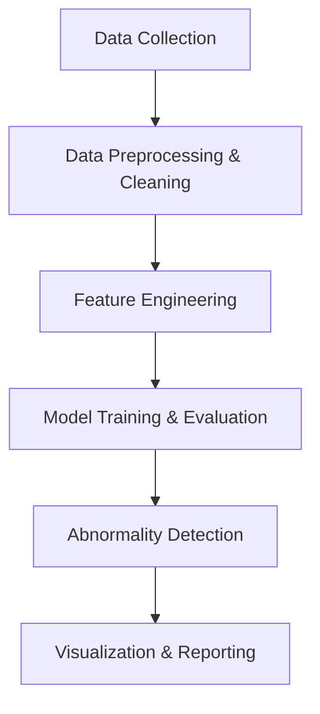

# 🧠 Detecting Medical Abnormalities

## 📌 Overview
The **Detecting Medical Abnormalities** project aims to build a machine learning pipeline capable of identifying irregularities in medical data — such as abnormal lab test results, radiology image patterns, or physiological signal deviations.  
By leveraging data analytics, feature extraction, and predictive modeling, this system helps clinicians and healthcare providers detect early warning signs, reduce diagnostic delays, and improve patient outcomes.

---

## 🎯 Objectives
- Detect anomalies in patient medical data using AI models.  
- Identify high-risk cases early based on abnormal trends.  
- Automate alert generation for potential diagnostic follow-up.  
- Improve accuracy and efficiency of clinical decision-making.

---

## 🧩 Project Workflow


## 🧠 Machine Learning Approach
| Step                    | Description                                                                                      |
| ----------------------- | ------------------------------------------------------------------------------------------------ |
| **Data Input**          | Collect patient data (e.g., vital signs, lab tests, imaging metrics).                            |
| **Data Cleaning**       | Handle missing values, normalize medical units, remove outliers.                                 |
| **Feature Engineering** | Extract features like heart rate variability, blood parameter ratios, or image texture features. |
| **Model Selection**     | Use anomaly detection or supervised models (e.g., Isolation Forest, Autoencoder, Random Forest). |
| **Evaluation**          | Use metrics such as AUC, Recall, Sensitivity, and Specificity.                                   |
| **Alert Generation**    | Flag patients with abnormal patterns for further review.                                         |


## 🧰 Tech Stack

- **Language:** Python (NumPy, Pandas, Scikit-learn, TensorFlow/PyTorch)

- **Visualization:** Matplotlib, Seaborn, Plotly

- **Dashboard (optional):** Streamlit or Power BI

- **Data Storage:** CSV / SQL / Medical database

- **Deployment (optional):** Flask API or Streamlit App

## 📊 Example Use Case

Detecting abnormal liver enzyme values from laboratory data to flag potential liver disease patients:
# Example snippet

``` python
import pandas as pd
from sklearn.ensemble import IsolationForest

# Load example medical data
data = pd.read_csv("medical_data.csv")

# Train anomaly detection model
model = IsolationForest(contamination=0.05, random_state=42)
data["abnormality_flag"] = model.fit_predict(data.select_dtypes(float))

# Identify abnormal cases
abnormal_patients = data[data["abnormality_flag"] == -1]
print("Detected Abnormal Cases:", abnormal_patients.shape[0])
```

## 📈 Visualization Ideas

- **Heatmap:** Correlation between medical features and anomalies.

- **Trend Chart:** Patient metrics over time highlighting outliers.

- **Distribution Plot:** Normal vs Abnormal groups comparison.

- **Dashboard:** Real-time abnormality alerts for clinicians.


## ⚙️ Folder Structure
```kotlin
Detecting_Medical_Abnormalities/
│
├── data/
│   ├── medical_data.csv
│
├── scripts/
│   ├── load_data.py
│   ├── preprocess_data.py
│   ├── feature_engineering.py
│   ├── train_model.py
│   ├── detect_anomalies.py
│   ├── visualize_results.py
│
├── app/
│   ├── streamlit_app.py
│
├── models/
│   ├── trained_model.pkl
│
├── reports/
│   ├── EDA_Report.ipynb
│
├── README.md
└── requirements.txt
```

## 🧪 Sample Results
| Metric    | Value |
| --------- | ----- |
| Precision | 0.91  |
| Recall    | 0.87  |
| F1 Score  | 0.89  |
| ROC-AUC   | 0.93  |

## 🚀 Future Enhancements

- Integrate deep learning models for image-based abnormality detection.

- Deploy a real-time dashboard for clinical alerting.

- Add explainable AI (XAI) for model interpretability.

- Enable API connectivity with hospital data systems.

## 📚 References

- Scikit-learn: Anomaly Detection

- TensorFlow Autoencoders for Anomaly Detection

- WHO Health Data Resources
## 💡 Key Insight

“Early detection saves lives — leveraging AI to identify subtle medical abnormalities can transform healthcare delivery.”
